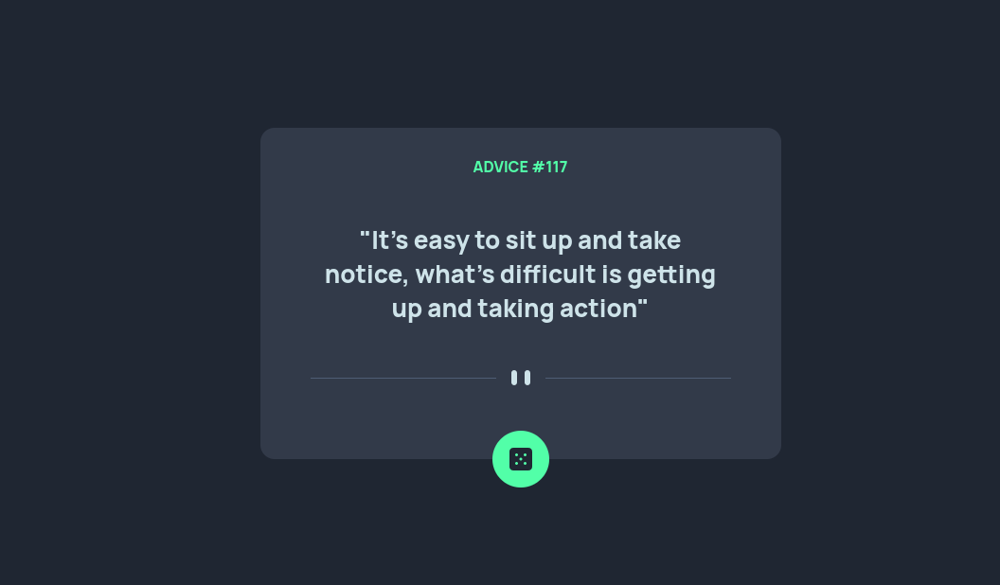

# Exercício 02 | App gerador de conselhos

## aplicando tecnicas de display flex, position e responsividade

este exercício já foi mais tranquilo de ser desenvolvido, ainda falta o melhoramento do mesmo com aplicações de JavaScript, mas é um projeto a ser alterado mais para frente

cada vez mais sendo agradável de estar aplicando os conhecimentos adquiridos, mesmo sendo simples consigo treinar funcionalidades que usarei direto, tornando mais simples a visualização e a criação com projetos mais complicados que virão mais pra frente

### link para acessar:

https://lucasramosfs.github.io/projeto03-gerador-de-conselhos/ 

